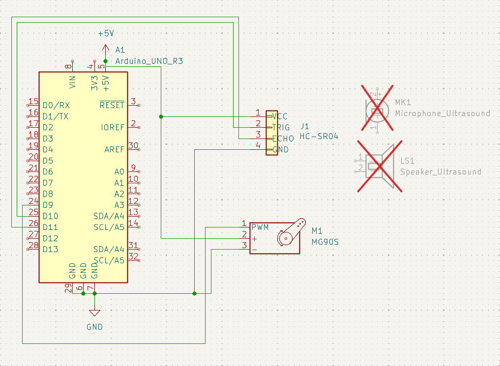
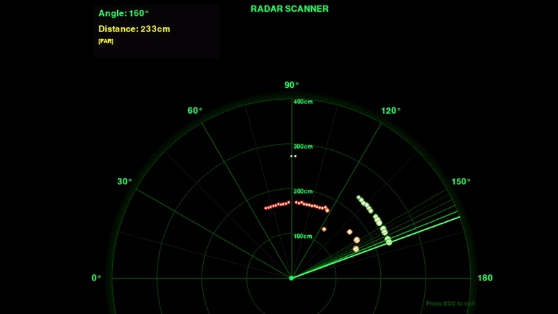

# <ins>__Arduino-radar__</ins>
Small arduino project with ultrasound sensor for radar mapping using **KiCad**, **ArduinoIDE** and **PyCharm** over serial comunication.

## Circuit schematic & setup (KiCad)
	Arduino Uno circuit; Servo PWM pin 9; Trig and Echo on 10 and 11 respectively

  
  

## Preliminary python based radar

>

	Issues:
	- lacking error correction for occasional false positive
	- "0" case not hidden

